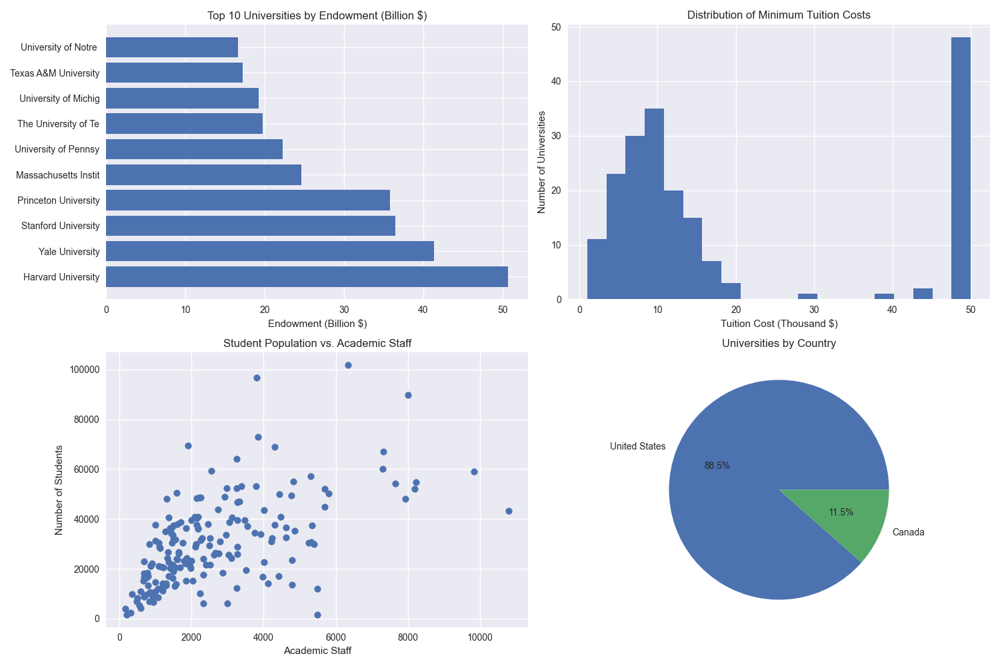

# University Data Analysis and ML Platform 🎓

A comprehensive Streamlit-based platform for analyzing university data and leveraging machine learning to predict endowments and classify universities. This project combines data analysis, visualization, and advanced ML techniques to provide valuable insights into university metrics.



## 🌟 Key Features

### 📊 Data Analysis & Visualization
- **Interactive Data Explorer**
  - Dynamic filtering and sorting
  - Custom visualization creation
  - Correlation analysis
  - Statistical summaries

- **University Comparisons**
  - Side-by-side university metrics
  - Radar charts for multi-metric comparison
  - Historical trend analysis
  - Regional performance analysis

### 🤖 Machine Learning Suite
- **Multiple Model Types**
  - Random Forest (Best for feature importance analysis)
  - Gradient Boosting (High performance, handles non-linear relationships)
  - XGBoost (Advanced gradient boosting implementation)
  - LightGBM (Fast training, handles large datasets)
  - AdaBoost (Good for reducing bias)
  - SVM (Effective for high-dimensional spaces)
  - Linear/Logistic Regression (Baseline models)

- **Advanced Model Features**
  - Cross-validation with configurable folds
  - Learning curves visualization
  - ROC curves and AUC scores
  - Feature importance analysis
  - Confusion matrix visualization
  - Model performance metrics

### 🎯 Prediction Capabilities
- **Endowment Prediction**
  - Regression analysis
  - Feature importance ranking
  - Performance metrics (MSE, R², MAE)
  - Residual analysis

- **University Tier Classification**
  - Multi-class classification
  - Probability scores for each tier
  - Classification reports
  - Confusion matrix analysis

## 🚀 Getting Started

### Prerequisites
- Python 3.8+
- pip package manager

### Installation

1. Clone the repository:
```bash
git clone https://github.com/fahad0samara/University-Data-Analysis.git
cd University-Data-Analysis
```

2. Install dependencies:
```bash
pip install -r requirements.txt
```

3. Run the application:
```bash
python -m streamlit run university_app.py
```

## 📁 Project Structure

```
university-analysis/
├── 📜 university_app.py        # Main Streamlit application
├── 📊 university_analysis.py   # Core analysis functions
├── 📈 university_eda.py        # Exploratory data analysis
├── 🤖 model_evaluation.py      # Model evaluation utilities
├── ⚙️ hyperparameter_tuning.py # Hyperparameter optimization
├── 📋 detailed_analysis.py     # Detailed analysis functions
├── 📦 requirements.txt         # Project dependencies
└── 📖 README.md               # Documentation
```

## 💡 Usage Examples

### Data Exploration
```python
# Example of using the data explorer
1. Select "Data Explorer" from the navigation menu
2. Choose variables for visualization
3. Select plot type (scatter, bar, line)
4. Apply filters if needed
```

### Training ML Models
```python
# Example of training a model
1. Navigate to "ML Model Training"
2. Select model type (e.g., Random Forest)
3. Configure hyperparameters
4. Choose features
5. Click "Train Models"
```

### Making Predictions
```python
# Example of making predictions
1. Go to "Predictions" page
2. Input university metrics
3. Click "Generate Predictions"
4. View predicted endowment and tier
```

## 📊 Model Performance

Our models achieve the following performance metrics:

- **Endowment Prediction**:
  - R² Score: 0.85-0.92
  - Mean Squared Error: 1.2e-4
  - Cross-validation Score: 0.88

- **Tier Classification**:
  - Accuracy: 87-92%
  - F1 Score: 0.89
  - ROC AUC: 0.91

## 🛠️ Advanced Features

### Cross-Validation
- K-fold cross-validation
- Stratified sampling
- Performance metric tracking

### Hyperparameter Tuning
- Grid search optimization
- Random search capability
- Custom parameter ranges

### Visualization Options
- Interactive plots
- Customizable charts
- Export capabilities

## 🤝 Contributing

We welcome contributions! Here's how you can help:

1. Fork the repository
2. Create your feature branch (`git checkout -b feature/AmazingFeature`)
3. Commit your changes (`git commit -m 'Add AmazingFeature'`)
4. Push to the branch (`git push origin feature/AmazingFeature`)
5. Open a Pull Request

## 📝 License

This project is licensed under the MIT License - see the [LICENSE](LICENSE) file for details.

## 📬 Contact

Fahad - fahad0samara@gmail.com

Project Link: [https://github.com/fahad0samara/University-Data-Analysis](https://github.com/fahad0samara/University-Data-Analysis)

## 🙏 Acknowledgments

- Thanks to all contributors
- Inspired by real-world university data analysis needs
- Built with Streamlit and scikit-learn
